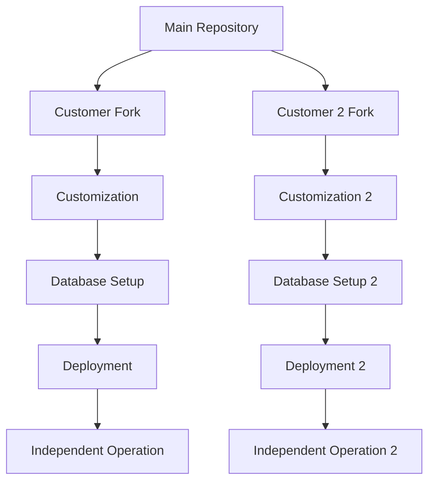

# 🔄 GitHub Repository Transfer Process

Hướng dẫn chi tiết về quy trình chuyển giao source code từ repository chính cho khách hàng mới.

## 📋 Tổng quan quy trình

### **Mô hình thương mại hóa: "Fork riêng + Database tách biệt"**



## 🚀 Quy trình Setup Khách hàng mới

### **Bước 1: Chuẩn bị**

1. **Thu thập thông tin khách hàng:**
   - Tên bệnh viện/cơ sở y tế
   - Domain mong muốn
   - Thông tin liên hệ
   - Yêu cầu customization đặc biệt

2. **Tạo configuration file:**
   ```bash
   cp config/customer-config.template.json config/customer-bv-abc.json
   # Chỉnh sửa thông tin khách hàng
   ```

### **Bước 2: Tạo Supabase Project mới**

1. **Truy cập Supabase Dashboard:**
   - Đăng nhập vào https://supabase.com
   - Tạo project mới với tên: `medical-equipment-[customer-code]`
   - Chọn region gần khách hàng nhất

2. **Lưu thông tin kết nối:**
   - Project URL
   - Anon key
   - Service role key

### **Bước 3: Fork Repository**

#### **Option A: Sử dụng GitHub CLI (Khuyến nghị)**

```bash
# Cài đặt GitHub CLI nếu chưa có
# https://cli.github.com/

# Fork repository
gh repo fork your-org/medical-equipment-template \
  --org customer-org \
  --repo-name bv-abc-medical-equipment \
  --private

# Clone fork
git clone https://github.com/customer-org/bv-abc-medical-equipment.git
cd bv-abc-medical-equipment
```

#### **Option B: Fork thủ công**

1. Truy cập repository gốc trên GitHub
2. Click "Fork" button
3. Chọn organization của khách hàng
4. Đặt tên repository: `[customer-code]-medical-equipment`
5. Chọn "Private" repository

### **Bước 4: Automated Setup**

```bash
# Chạy script setup tự động
node scripts/setup-new-customer.js --config=config/customer-bv-abc.json
```

Script sẽ tự động:
- ✅ Customize branding (app name, colors, logos)
- ✅ Tạo environment variables
- ✅ Setup database schema với sample data
- ✅ Tạo deployment instructions

### **Bước 5: Manual Customization (nếu cần)**

1. **Update logos và assets:**
   ```bash
   # Thay thế logo
   cp customer-assets/bv-abc-logo.png public/icons/
   cp customer-assets/bv-abc-favicon.ico public/
   ```

2. **Customize colors (nếu cần):**
   ```bash
   # Chỉnh sửa src/app/globals.css
   # Update CSS variables với màu sắc của khách hàng
   ```

### **Bước 6: Testing**

```bash
# Install dependencies
npm install

# Start development server
npm run dev

# Test các chức năng chính:
# - Login với admin account
# - Thêm/sửa/xóa thiết bị
# - Tạo yêu cầu sửa chữa
# - Quét QR code
# - Báo cáo
```

### **Bước 7: Deployment**

```bash
# Deploy to Vercel
vercel --prod

# Hoặc sử dụng GitHub Actions (nếu đã setup)
git push origin main
```

## 🔐 Bảo mật và Tách biệt

### **Database Isolation**
- ✅ Mỗi khách hàng có Supabase project riêng biệt
- ✅ Không shared data giữa các khách hàng
- ✅ Independent authentication systems
- ✅ Separate backup và recovery

### **Code Isolation**
- ✅ Mỗi khách hàng có repository riêng
- ✅ Independent deployment pipelines
- ✅ Separate environment variables
- ✅ Custom domain cho mỗi khách hàng

### **Access Control**
- ✅ Repository access chỉ cho team của khách hàng
- ✅ Supabase project access riêng biệt
- ✅ Deployment access độc lập

## 📊 Monitoring và Maintenance

### **Health Monitoring**
```bash
# Script kiểm tra health của tất cả customer deployments
node scripts/monitor-customers.js

# Kiểm tra specific customer
node scripts/health-check.js --customer=bv-abc
```

### **Updates và Patches**
1. **Security updates:** Apply ngay lập tức cho tất cả customers
2. **Feature updates:** Optional, theo yêu cầu khách hàng
3. **Bug fixes:** Apply theo priority

### **Backup Strategy**
- **Database:** Supabase automatic backups + manual exports
- **Code:** GitHub repository backups
- **Assets:** Cloud storage backups

## 🆘 Troubleshooting

### **Common Issues**

1. **Database connection failed:**
   ```bash
   # Kiểm tra Supabase credentials
   # Verify network connectivity
   # Check Supabase project status
   ```

2. **Build errors:**
   ```bash
   # Clear cache
   rm -rf .next node_modules
   npm install
   npm run build
   ```

3. **Deployment issues:**
   ```bash
   # Check environment variables
   # Verify domain configuration
   # Review deployment logs
   ```

## 📞 Support Process

### **Escalation Levels**
1. **Level 1:** Basic configuration và deployment issues
2. **Level 2:** Custom development và integration
3. **Level 3:** Critical system issues và security

### **Response Times**
- **Critical:** 2 hours
- **High:** 8 hours  
- **Medium:** 24 hours
- **Low:** 72 hours

## 📈 Scaling Considerations

### **Performance Optimization**
- Database indexing cho large datasets
- CDN setup cho static assets
- Caching strategies
- Load balancing (nếu cần)

### **Multi-tenant Features**
- Shared components library
- Common update mechanisms
- Centralized monitoring
- Bulk operations tools

---

## 🎯 Success Metrics

- **Setup Time:** < 2 hours per customer
- **Deployment Success Rate:** > 95%
- **Customer Satisfaction:** > 4.5/5
- **System Uptime:** > 99.9%
